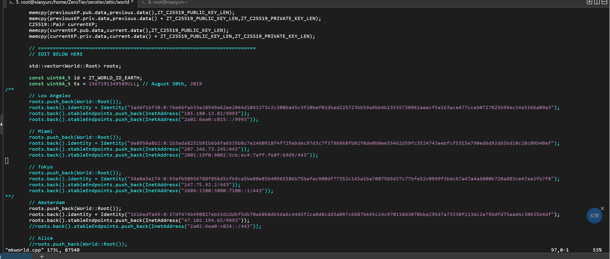

# 搭建zerotier的planet服务器
此处使用的系统是CentOS Stream 9 64位
## 云服务器端：
### 1、下载官网的linux版本zerotier（客户端版）：
运行：`curl -s https://install.zerotier.com | sudo bash`  
或者上传.rpm文件,运行`dnf install zerotier-one-1.14.1-1.el9.x86_64.rpm`   
安装包网址：https://download.zerotier.com/RELEASES/ 
### 2、获取密钥和身份
去到`/var/lib/zerotier-one/`文件夹下，运行`cat authtoken.secret`和`cat identity.public`获取密钥和身份，并记录
### 3、下载官方源码并解压
`wget https://github.com/zerotier/ZeroTierOne/archive/refs/tags/1.14.1.tar.gz`（可直接上传）  
`tar -xzf ZeroTierOne-1.14.1.tar.gz`

### 4、修改mkworld.cpp文件
进入解压得到的文件夹中的`/attic/world`,修改其中的`mkworld.cpp`文件  
修改ip和端口和identity即可，identity为上面记录的，其他三个ip注释掉  


### 5、在world文件夹中依次运行
（需要此前安装c++和json库，`dnf install gcc-c++`，`dnf install epel-release`，`dnf install nodejs`） 
```
source ./build.sh
./mkworld
mv ./world.bin ./planet
cp -r ./planet /var/lib/zerotier-one/
cp -r ./planet /root
```
 
将最后得到的planet文件复制出来作为客户端使用
### 6、部署ztncui
官网：https://key-networks.com/ztncui/#installation  
依次运行：
```
dnf install https://download.key-networks.com/el7/ztncui/1/ztncui-release-1-1.noarch.rpm -y
dnf install ztncui --nogpgcheck
```
（或者上传.rpm文件,运行dnf install ztncui-release-1-1.noarch.rpm安装）  
随后开启服务器的3443端口
### 7、修改ztncui配置（注意：.env文档里面不能有空格，等号直接连接两头）
```
sh -c "echo ZT_TOKEN=` cat /var/lib/zerotier-one/authtoken.secret` > /opt/key-networks/ztncui/.env"
sh -c "echo HTTPS_PORT=3443 >> /opt/key-networks/ztncui/.env"
sh -c "echo ZT_ADDR=localhost:9993 >> /opt/key-networks/ztncui/.env"（这个端口为zerotier开放端口）
sh -c "echo NODE_ENV=production >> /opt/key-networks/ztncui/.env"
sh -c "echo HTTP_ALL_INTERFACES=yes  >>./.env"
chmod 400 /opt/key-networks/ztncui/.env
chown ztncui.ztncui /opt/key-networks/ztncui/.env
```
安装好后默认账号admin密码password
### 8、重启服务
```
systemctl restart ztncui
systemctl restart zerotier-one
```
### 9、访问主机ip端口3443即可管理
如：https://47.102.194.65:3443

## windows客户端：
找到zerotier安装位置，替换掉plant  
win+r，输入services.msc  
找到zerotier one  
重启动此服务  
cmd(管理员身份)中输入：  
zerotier-cli.bat peers查看根服务器  
zerotier-cli.bat join 1b16edfa69a135bf（加入网络，后面的数替换为自己创建的network代号）  
随后回到控制台网页，刷新，勾选授权，再次刷新即可

## 移动端：
安装zerotierfix  
导入plant  
授权vpn模式  
加入网络即可